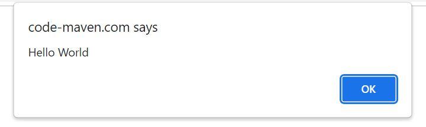
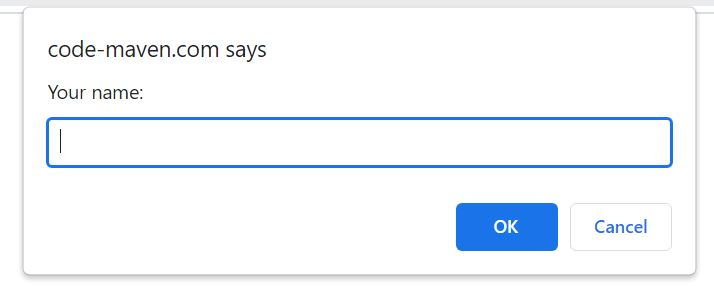

# JAVASCRIPT

## What is JavaScript? ##

JavaScript is a programming language that enables users to create dynamic content, control multimedia, animate images and much more. Javascript adds functionality and interactivty to websites and adds the finishing touch to plain HTML. 

## What are the variables in JavsScript? ##

Variables are containers for storing data (storing data values) and there are 4 ways to declare them:

1. Using 'var'
2. Using 'let'
3. Using 'const'
4. Using nothing

## How and when to use JavaScript variables? ##

The 'var' variable keyword is used in all JavaScript code from 1995 to 2015.

The 'let' and 'const' keywords were addd to JS in 2015.

So if you want your code to run in older browsers, you must use 'var'.

**Const and Let:**

If you want a genereal rule always use the variable 'const'

If, on the other hand, you think the value of the variable can change, use 'let'.

For example:

    const price1 = 5;
    const price2 = 6;
    let total = price1 + price2;

## Input & Output ##

There are a number of ways JS can display text for the user (output). The most simple one is by using the 'alert' function:

- Alert:

This will show a pop-up in the broweser with text. The 'alert ()' function is rarely used but it's a easy way to show the use of JS.

        alert("Hello World");

Once we know how to show output from JS, let's find out how to receive input. Neither of these is either used a lot, but they are great to play around with the basics.

- Prompt:

This will show a pop-up window with text and then a box where users will have to write. Once the user presses OK, the value they have entered will be returned in the 'prompt()' function.

        var name = prompt("Your name:", "");
        document.write("Hello ", name);

- Confirm:

The other pop-up is not really an input method but it allows the developer to ask a yes/no question. Calling the 'confirm()'  function will show a pop-up window with the provided texts and with two buttons. If the user presses OK the 'confirm()' function will return TRUE, but the user presses the CANCEL or hits the ESC key, the function will return FALSE.

For this to make more sense you will hae to understand that TRUE and FALSE really mean, which is "if - else". To make it easy, let's use this example: IF user presses OK, then do this, otherwise do something ELSE.

        if (confirm("Shall I print Hellow World?")) {
            document.write("Hello world");
        } else {
            document.write("Ok, I won't print Hello World then");
        }